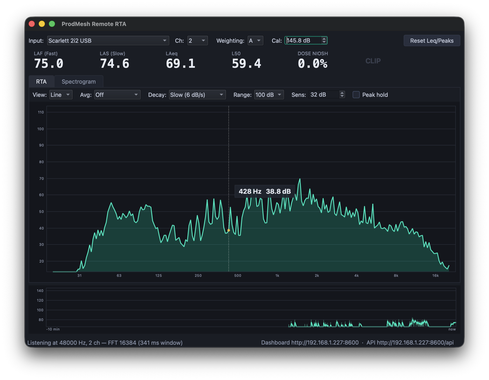
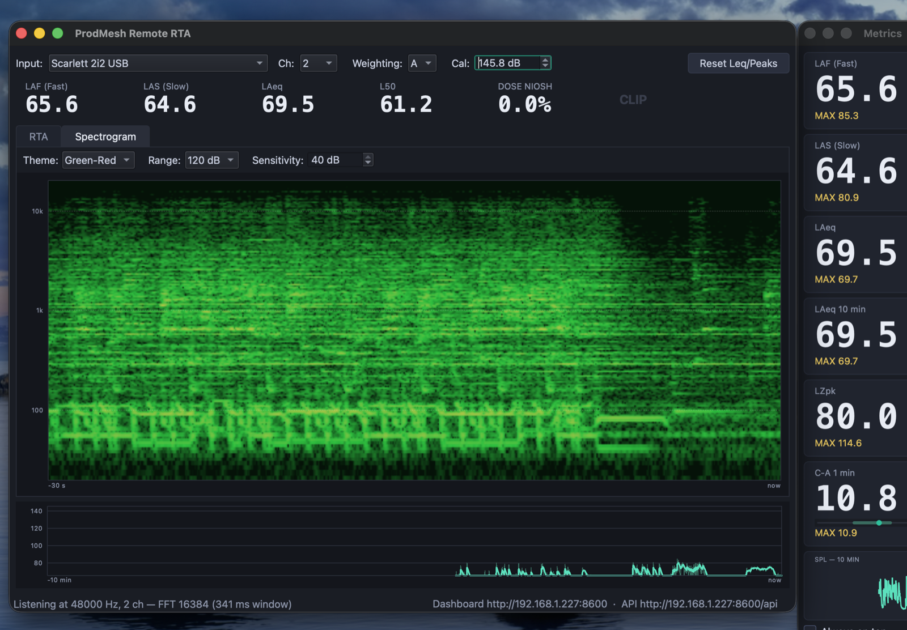

# ProdMesh Remote RTA

[](https://github.com/jbeale/prodmesh-rta/actions/workflows/build.yml)





A minimal, free, cross-platform (Windows / macOS) SPL meter and spectrum
analyzer, part of the ProdMesh production toolkit: point it at any microphone
input and get

- **SPL meter** — Fast (125 ms), Slow (1 s), and Leq (average since reset),
  with **A / C / Z** frequency weighting
- **RTA** — 31-band 1/3-octave real-time spectrum, 20 Hz – 20 kHz, with
  selectable averaging and peak hold
- Input device picker, clip indicator, calibration offset

The C++ version additionally has:

- **Two measurement modes** (**Settings → Input & Mode…**) — *Acoustic* meters
  a room through a microphone in dB SPL; *Program* meters a stream or console
  bus against digital full scale, with **EBU R128 / ITU-R BS.1770 loudness**
  instead of the exposure metrics: momentary, short-term and gated integrated
  **LUFS**, 4× oversampled **true peak** (dBTP), PLR, and delivery-target
  presets for YouTube/Spotify/Twitch, Apple Podcasts, EBU R128 and ATSC A/85
- **Loudness meter** — big gated Integrated readout, M/S bars on a
  target-centred scale, shaded target zone, and true-peak over-counting
- **Stereo scope** (Program mode) — goniometer with phosphor persistence,
  phase correlation, L/R balance, and a **mono-compatibility** figure in LU:
  the polarity-flipped channel that sounds fine on monitors and vanishes for
  every phone and TV listener is the failure this catches
- **Loudness range (LRA)** and a timestamped **true-peak overshoot log**, so
  there is a QC record after the service rather than just a count
- **Spectrogram** — scrolling log-frequency heat map (tab next to RTA)
  with selectable color themes, range, sensitivity, and time span
  (10 s – 10 min), plus a hover frequency cursor
- **Split view** — Smaart-style stacked RTA + bottom-up spectrogram
  sharing the frequency axis, with a linked hover cursor across both
- **Hi-res RTA line view** — 1/24-octave line spectrum with hover
  frequency/level readout (bar view snaps to the band); all view options
  live in **Settings → Display…** and apply live
- **SPL history strip** — the last 10 minutes of Fast/Slow at a glance
- **Smaart-style SPL metrics** — rolling LAeq (two configurable windows),
  LZpk/LCpk, C-A ratio, L10/L50/L90, NIOSH/OSHA dose; pick which appear in
  the top bar and breakout under **Settings → Metrics…**
- **Metric breakout** — a narrow always-on-top window of big readouts (with
  click-to-reset maxima and an SPL sparkline) to park next to your console
  software (**View → Metric Breakout**, Ctrl/Cmd+B)
- **Alarms** — traffic-light thresholds on a watched metric, plus **signal-loss
  detection** (digital black after 1 s, low-level silence after a configurable
  horizon) with a banner in the app and on the dashboard, a `signal` field on
  every API payload, and an edge event on the WebSocket
  (**Settings → Alarms…**)
- **SPL logging** — 1 Hz CSV of every metric for compliance records
  (**File → Start SPL Log…**); columns follow the active mode
- **Web dashboard** — a live browser page (readouts, metric grid, RTA bars)
  served at the API root, viewable from any device on the LAN
- **Persistent settings** — cal, weighting, device, averaging, API config,
  and window geometry survive restarts
- **HTTP + WebSocket API** — JSON endpoints other machines can poll, plus a
  live push stream (see below); configured from **Settings → API & Streaming**

Two implementations live in this repo:

- **C++** — `src/` (pure Qt 6 Widgets + Multimedia + Network, no other
  dependencies; FFT included). The full-featured version described above;
  compiles to a native binary with CMake.
- **Python** — `rta.py` (PySide6 + sounddevice + NumPy). The original
  minimal version: SPL meter + RTA only, zero build step. Handy as a
  readable reference or if you just need a quick meter.

## Running the Python version

### Windows

Double-click **`run.bat`** — it creates a local virtual environment, installs
the three dependencies, and starts the app. Needs Python 3.10+ installed
(from [python.org](https://www.python.org/downloads/) or
`winget install Python.Python.3.12`).

### macOS

```bash
chmod +x run.command      # once
./run.command             # or double-click it in Finder
```

Needs Python 3 (`brew install python` or from python.org). The first launch
will trigger the macOS microphone-permission prompt — grant it to Terminal
(or whatever launched the app) in
System Settings → Privacy & Security → Microphone.

### Manually (either OS)

```bash
python -m venv .venv
.venv/bin/pip install -r requirements.txt      # Windows: .venv\Scripts\pip
.venv/bin/python rta.py                        # Windows: .venv\Scripts\python
```

## Downloads / releases

Prebuilt zips for Windows and macOS are on the
[Releases page](https://github.com/jbeale/prodmesh-rta/releases) — each
release includes install notes for the unsigned-binary prompts. To cut a
release (maintainers): bump `VERSION` in `CMakeLists.txt`, commit, then

```bash
git tag v0.4.0 && git push origin v0.4.0
```

The `release` workflow builds both platforms, runs the selftest, and
publishes the release automatically. Ordinary pushes never create releases.

## Building the C++ version

### The easy way

- **Windows**: install Qt from [qt.io](https://www.qt.io/download-qt-installer)
  (Qt 6.x Desktop with the **MinGW** kit, **Qt Multimedia** under Additional
  Libraries, and CMake/Ninja/MinGW under Build Tools), then double-click
  **`build.bat`**. It finds Qt automatically and leaves a self-contained
  `build\` folder — `ProdMeshRemoteRTA.exe` runs on any Windows PC.
- **macOS**: `chmod +x build.sh && ./build.sh` — installs qt/cmake/ninja via
  Homebrew if needed and produces `build/ProdMeshRemoteRTA.app` with the Qt
  frameworks bundled.

### By hand

Needs CMake 3.16+, a C++17 compiler, and Qt 6 (Widgets + Multimedia + Network).

### Windows (MSYS2/MinGW)

```bash
pacman -S mingw-w64-x86_64-gcc mingw-w64-x86_64-cmake mingw-w64-x86_64-ninja \
          mingw-w64-x86_64-qt6-base mingw-w64-x86_64-qt6-multimedia
cmake -B build -G Ninja
cmake --build build
./build/ProdMeshRemoteRTA.exe
```

With the official Qt installer (Qt 6.x + MinGW kit):

```
cmake -B build -G Ninja -DCMAKE_PREFIX_PATH=C:\Qt\6.11.1\mingw_64
cmake --build build
```

With MSVC + the official Qt installer instead:
`cmake -B build -DCMAKE_PREFIX_PATH=C:\Qt\6.x.x\msvc2022_64 && cmake --build build --config Release`

To make a self-contained folder you can copy to another PC, run
`windeployqt build/ProdMeshRemoteRTA.exe`.

### macOS

```bash
brew install qt cmake ninja
cmake -B build -G Ninja
cmake --build build
open build/ProdMeshRemoteRTA.app
```

The app bundle includes the microphone-permission string, so macOS will
prompt on first launch. `macdeployqt build/ProdMeshRemoteRTA.app` makes it
portable — but note two gotchas `build.sh` handles for you:

- macdeployqt invalidates the code signature while bundling; re-sign with
  `codesign --force --deep --sign - build/ProdMeshRemoteRTA.app` or Apple
  Silicon kills the process on launch (`SIGKILL (Code Signature Invalid)`).
- Never rebuild into an already-deployed bundle — the freshly built binary
  will load Homebrew's Qt *and* the bundled frameworks and crash on startup.
  Delete the `.app` before rebuilding (or just use `build.sh`).

`--selftest` runs the same DSP check as the Python version (on Windows the
output only appears when redirected:
`ProdMeshRemoteRTA.exe --selftest > out.txt`).

## Using it

- **Input** — pick your microphone. On Windows the same physical mic shows up
  under several host APIs; the **[Windows WASAPI]** entry usually gives the
  native sample rate (48 kHz) and lowest latency.
- **Ch** (C++ version) — on multi-input interfaces, which channel feeds the
  analyzer (e.g. the input your measurement mic is on — channel 1 by
  default). **Mix** averages all channels; note that unused channels then
  dilute the level (a mic alone on one of 8 inputs reads ~9 dB low per
  doubling). Reported as `input_channel` in `/api/status`.
- **Weighting** — A (default, matches most SPL specs), C, or Z (flat).
  Applies to both the SPL readouts and the RTA display; the readout labels
  follow (LAF/LCF/LZF, etc.).
- **RTA avg** — smoothing for the spectrum bars. **Peak hold** overlays a
  slowly decaying max line per band.
- **Reset Leq/Peaks** — restarts the Leq average and clears peak hold.
- **CLIP** lights red when the input is within ~0.1 dB of full scale.

### Program mode — metering a stream (C++ version)

**Settings → Input & Mode…** switches between *Acoustic* (a mic in a room,
dB SPL) and *Program* (a digital bus, LUFS). Program mode hides the Cal
offset — full scale is the reference, so there is nothing to calibrate — and
swaps the exposure metrics for EBU R128 loudness:

| Id | Meaning |
|---|---|
| `lufsM` | Momentary loudness, 400 ms sliding window |
| `lufsS` | Short-term loudness, 3 s sliding window |
| `lufsI` | Integrated loudness, gated (−70 LUFS absolute, then −10 LU relative) |
| `toTarget` | Integrated minus the delivery target, in LU |
| `dbtp` | True peak over the last 400 ms, 4× oversampled |
| `dbtpMax` | True-peak maximum since the last Reset |
| `plr` | Peak-to-loudness ratio (`dbtpMax` − `lufsI`) |
| `lra` | Loudness range (EBU Tech 3342), 10th–95th percentile spread in LU |
| `monoDelta` | LU lost when the pair is summed to mono |
| `corr` | Stereo correlation, −1 (inverted) … +1 (mono) |
| `balance` | R − L level difference, dB |
| `dbtpL` / `dbtpR` | Per-channel true-peak maximum |

### Reading the stereo metrics

The **Stereo** tab shows a goniometer (the pair rotated 45°, mid vertical) with
correlation, balance and mono loss beside it. What the shapes mean:

- **vertical line** — mono; **round/rosette cloud** — very wide stereo
- **horizontal line** — a channel is polarity-flipped. This sounds fine on
  monitors and *cancels* for anyone listening in mono, which is phone speakers
  and most TVs — i.e. most of a livestream audience.

**`monoDelta` is the number to act on**, because it is in the same units as the
delivery target. Some loss is physics, not a fault: fully decorrelated stereo
loses exactly 3 LU when summed, so anything down to about −3 LU is normal.
Past −6 LU something in the mix is cancelling itself.

Correlation dithering around 0 on wide material is likewise normal — only a
*sustained* negative reading indicates a polarity problem.

`lra` needs at least 10 s of short-term data before it reports anything; below
that a range figure would be noise dressed as a statistic. Typical values:
3–5 LU for a heavily limited pop master, 6–12 LU for a service mix with room
to breathe.

Integrated loudness, LRA and the true-peak maximum are **session** metrics, so
hit **Reset Leq/Peaks** when the stream starts. Loudness is the BS.1770 sum of the
stereo pair chosen in the dialog; the RTA keeps following the **Ch** selector.

The app captures from *input* devices, so the programme bus has to reach it as
one — via an aggregate or loopback device:

- **macOS** — [BlackHole](https://existential.audio/blackhole/) (2ch), either
  on its own or inside an Aggregate Device so you can monitor and meter at the
  same time. Point your playback/streaming app's output or monitor path at it.
- **Windows** — Qt enumerates capture endpoints, not WASAPI loopback, so use
  VB-Audio Virtual Cable (or Stereo Mix, if your interface exposes it).

Measure as late in the chain as you can — after the master fader and any bus
processing — so the numbers match what actually gets encoded. Pick a target
from the presets (YouTube/Spotify/Twitch −14 LUFS, Apple Podcasts −16, EBU
R128 −23, ATSC A/85 −24) and keep true peak under the ceiling: lossy encoders
reconstruct inter-sample peaks that plain sample-peak metering never sees,
which is why −1 dBTP is the usual safe limit.

### Calibration

Mics are not calibrated out of the box, so absolute dB SPL is only as good as
the **Cal** offset (displayed level = dBFS + Cal). In the C++ app use
**Settings → Calibrate SPL…**: put the mic on a calibrator (or play steady
pink noise measured by a meter/app you trust), enter that reference level,
press **Capture** — the app averages ~1.5 s and computes the offset for you.
The offset stays valid for that mic *at that preamp/input-gain setting*;
change the gain and you must recalibrate. Uncalibrated, the numbers are still
perfectly usable as relative measurements.

If you have a Smaart rig calibrated on the same mic/interface/gain, its
dBFS→SPL offset is conceptually the same number — but verify side-by-side
once, since different driver paths can shift full-scale by a fixed dB.

### SPL metrics (C++ version)

**Settings → Metrics…** chooses which metrics appear above the graphs and in
the breakout window. Ids (as used in the CSV log and API):

| Id | Meaning |
|---|---|
| `laf` / `las` | Fast (125 ms) / Slow (1 s) level, displayed weighting |
| `leq` | Leq since the last Reset |
| `leqS` / `leqL` | rolling LAeq over the short/long window (configurable, 10 s – 1 h) |
| `lzpk` / `lcpk` | unweighted / C-weighted peak (time-domain C filter) |
| `ca` | C-A ratio over the short window (low-frequency energy indicator) |
| `l10` / `l50` / `l90` | level exceeded 10/50/90 % of the session (needs ≥ 10 s) |
| `doseN` / `doseO` | % of daily noise dose — NIOSH 85 dBA/3 dB and OSHA 90 dBA/5 dB, 80 dBA threshold |

Session statistics (Leq, percentiles, dose) reset with the **Reset** button;
dose and percentiles assume the Cal offset gives true dB SPL.

### Alarms, logging, and the web dashboard (C++ version)

- **Settings → Alarms…** watches one metric against warning/alert
  thresholds; its readouts turn yellow/red everywhere (top bar, breakout,
  dashboard), and the state is served on the API.
- **File → Start SPL Log…** appends one CSV row per second — ISO timestamp,
  every metric id above, and the alarm state (0/1/2) — flushed every 10 s.
- The **web dashboard** is served at the API root URL (shown in the status
  bar): live readouts, the full metric grid, and RTA bars in any browser on
  the LAN. Self-contained — no internet access needed.

### Mic correction files (C++ version)

**Settings → Load Mic Correction…** accepts standard measurement-mic
calibration text files (REW / miniDSP UMIK style): lines of
`<frequency Hz> <response dB>`, whitespace- or comma-separated; comment and
header lines are skipped. The response curve is interpolated log-frequency
and **subtracted** from the spectrum (the usual convention — the file
describes the mic's deviation from flat). Applies to the SPL readouts, RTA,
spectrogram, and everything served over the API; the loaded file persists
across restarts and is reported in `/api/status` as `mic_correction`.

## HTTP + WebSocket API (C++ version)

Enable it under **Settings → API & Streaming…** (or launch with
`ProdMeshRemoteRTA --api 8517`). The URL in the status bar is reachable from
any machine on the LAN — allow the app through the firewall when Windows
asks. On multi-NIC FOH machines the **Interface** picker binds the server to
one network (e.g. your control LAN, or localhost only) so Dante / SoundGrid
networks never see HTTP traffic. All endpoints are read-only GETs returning JSON with
`Access-Control-Allow-Origin: *`:

| Endpoint | Returns |
|---|---|
| `/` | live browser dashboard (readouts, metric grid, RTA bars) |
| `/api` | JSON index of the endpoints below |
| `/api/status` | sample rate, weighting, cal, uptime, history length |
| `/api/spl` | current `fast_db`, `slow_db`, `leq_db` + `metrics` + `alarm` |
| `/api/rta` | `centers_hz` + `bands_db` (31 values) + `peaks_db` + `metrics` |
| `/api/history?since_ms=&limit=` | 1 Hz level samples, up to 6 hours |
| `/api/overs` | timestamped true-peak overshoots this session |
| `ws://…/api/stream` | WebSocket: pushes SPL + bands at the configured rate |

`metrics` maps metric ids to values; `alarm` reports the watched metric,
thresholds, and traffic-light `state` (0 ok / 1 warning / 2 alert).

Every payload carries a **`mode`** field — `"acoustic"` or `"program"` —
and *which metric ids are present depends on it*, so switch on `mode` before
reading them:

- `acoustic`: `laf las leq leqS leqL lzpk lcpk ca l10 l50 l90 doseN doseO`
  (dB SPL, cal offset applied)
- `program`: `laf las leq lzpk` (now dBFS) plus `lufsM lufsS lufsI toTarget
  dbtp dbtpMax plr`, and a `loudness` object with `target_lufs` and
  `ceiling_dbtp` so a client can draw the same target zone the app does

### Detecting dead air

Every payload carries a `signal` object:

```json
"signal": { "state": "ok", "silent_for_s": 0.0, "last_audio_ms": 1784957744422,
            "enabled": true, "threshold_db": -60 }
```

`state` is `ok`, `silent` (below `threshold_db` for the configured horizon) or
`black` (samples at exactly zero — the route is dead, reported after 1 s since
it cannot be a musical pause). WebSocket clients also get an edge event so
they don't have to diff the level stream:

```json
{ "type": "event", "event": "silence_start", "reason": "digital_black",
  "threshold_db": -60, "last_audio_ms": 1784957744422, "time_ms": 1784957760001 }
```

**Watch `time_ms` as well.** The app can report silence it can hear, but it
cannot report its own death — a crashed process or a dropped NIC looks
exactly like a healthy quiet one. Treat a snapshot that stops advancing as its
own alarm; that is the other half of dead-air detection.

Configure the threshold and horizon under **Settings → Alarms…**. There is
deliberately no audible alert: on a stream machine, system sound can land back
in the capture path and go out on air.

### Live streaming

Connect a WebSocket to `/api/stream` on the same port and you'll receive a
`{"type":"levels", …}` message (same fields as `/api/spl` + `/api/rta`) at
the stream rate chosen in Settings (1/5/10/20 Hz, default 10):

```js
// Node.js 21+ / browsers (Node <21: npm i ws, then `new (require("ws"))(url)`)
const ws = new WebSocket("ws://192.168.1.18:8517/api/stream");
ws.onmessage = (ev) => {
  const m = JSON.parse(ev.data);
  console.log(m.fast_db, m.slow_db, m.bands_db);
};
```

`/api/history` is designed for logging a whole event with cheap incremental
polls — pass the timestamp of the last sample you already have:

```js
// Node.js: collect SPL over the course of a service
const BASE = "http://192.168.1.18:8517";   // shown in the RTA app
let since = 0;
setInterval(async () => {
  const { samples } = await (
    await fetch(`${BASE}/api/history?since_ms=${since}`)
  ).json();
  if (samples.length) {
    since = samples.at(-1).t;
    for (const s of samples) {
      // s = { t: epoch ms, fast_db, slow_db, leq_db }
      store(s);
    }
  }
}, 30_000);  // any interval ≤ 6 h works; history survives between polls
```

Levels are `null` in JSON until the input has data. History is in-memory and
clears when the app closes.

## Troubleshooting

- **Levels drop to nothing a few seconds after you stop talking** — that's a
  noise gate / noise suppression applied by the OS or audio driver, not the
  app. On Windows: Settings → System → Sound → your microphone → Advanced →
  turn **Audio enhancements** off (on some Realtek systems it's in the
  Realtek Audio Console instead). For measurement use you want every
  "enhancement" (noise suppression, AGC, echo cancellation) disabled.
- **Meter pinned near the floor (~0–5 dB)** — wrong input selected (e.g. an
  unconnected line-in jack) or the mic's input gain is near zero in the OS
  sound settings.

## License

This project's code is MIT-licensed (see [LICENSE](LICENSE)). It dynamically
links Qt (and, for the Python version, PySide6), which are used under the
terms of the **LGPLv3** — the Qt libraries are shipped as separate,
replaceable DLLs/frameworks and remain under their own license. Qt source is
available at <https://code.qt.io>. Do not switch to a statically linked Qt
build without revisiting LGPL compliance.

## Notes / limits

- Levels are computed from a 16k FFT (Hann window); Fast/Slow are exponential
  time weightings applied to the band-limited (20 Hz – 20 kHz) power, so the
  ballistics closely track a real meter but this is not a Class 1 instrument.
- Below ~50 Hz the 1/3-octave bands are narrower than the FFT resolution at
  44.1/48 kHz; those bands are estimated from spectral density and are
  correspondingly coarser.
- A DSP sanity check is built in: `--selftest` (both versions) verifies a
  full-scale 1 kHz sine reads −3.01 dBFS in the 1 kHz band. The C++ version
  additionally checks the hi-res spectrum peak, the A/C/Z broadband powers,
  the time-domain C-weighting filter's 1 kHz gain, mic-correction math, and
  the metrics engine (rolling Leq windows, C-A ratio, L10/L50/L90
  percentiles, and NIOSH/OSHA dose against closed-form expected values).
  CI runs it on both platforms and it gates releases.
